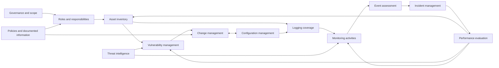
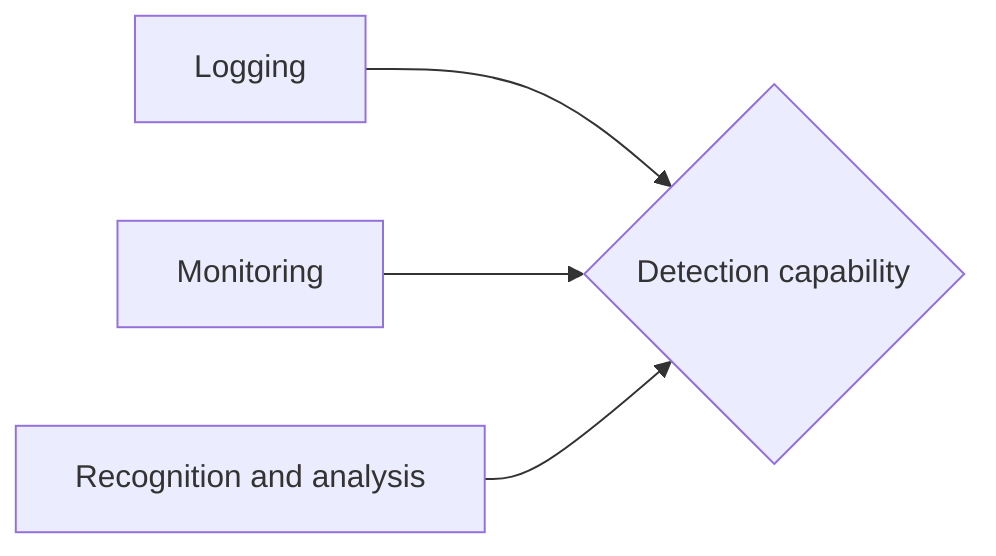
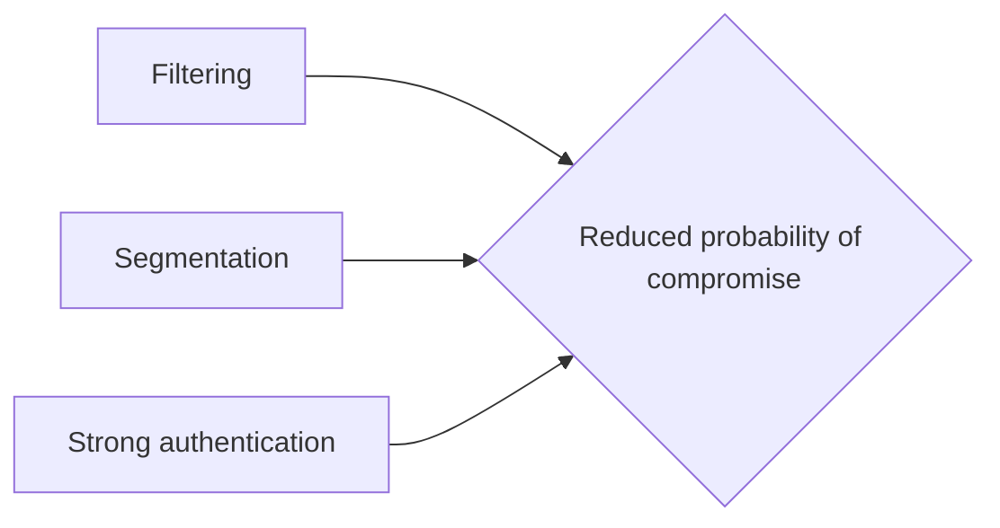

# ISO 27001 Control Dependency Map

## Project overview

ISO/IEC 27001 is often presented as a list of requirements and controls. In practice, the controls do not work as isolated items. They form an interconnected system.

> [!IMPORTANT]
An asset inventory supports vulnerability management. --> Vulnerability management depends on change and configuration management. --> Logging provides visibility, --> but logging alone does not create detection. --> Monitoring, analysis, responsibilities, and incident processes must also work.

This project aims to make those relationships visible.

The main question is:

> If one control becomes ineffective, which other controls lose part of their ability to work?


The project will produce:

- a structured control dependency dataset;
- an interactive network graph;
- evidence requirements for each control;
- dependency strength and confidence ratings;
- a centrality score showing which controls support the largest part of the system.

The intended users are CISOs, security managers, consultants, auditors, and implementation teams.

---

## Why this matters

A flat checklist can show whether a control has been documented or implemented. It does not clearly show:

- which controls are prerequisites for others;
- which controls provide data to other controls;
- which controls depend on the same evidence;
- which failures create downstream degradation;
- which controls should be implemented or improved first;
- which controls work only as part of a larger control set.

This can lead to checkbox compliance. A control may appear complete while the surrounding system needed to make it effective is missing.

For example:

- an asset inventory may exist but may not be complete or regularly verified;
- vulnerability scanning may run but may not cover unknown assets;
- logs may be collected but not reviewed;
- backups may exist but recovery procedures may not be tested;
- access reviews may occur without reliable ownership or system criticality data.

The dependency map is intended to show these gaps as system weaknesses rather than isolated findings.

---

## Project scope

The final model will include:

1. ISO/IEC 27001 clauses 4–10;
2. ISO/IEC 27001:2022 Annex A controls;
3. relationships between controls;
4. AND and OR control logic;
5. control evidence;
6. FAIR-CAM functional mappings;
7. control centrality and downstream degradation;
8. scale sensitivity.

The project will be developed gradually:

| Stage | Scope | Main result |
|---|---|---|
| MVP | A small set of foundational controls and their dependencies | Validated data model and first interactive graph |
| Version 1 | Major dependency clusters across clauses 4–10 and Annex A | Usable management-level dependency map |
| Version 2 | All controls, evidence requirements, AND/OR groups, and centrality | Full control dependency system |
| Version 3 | Filters, simulations, organisation profiles, and exports | Practical decision-support tool |

---

## Conceptual model

The project treats ISO 27001 as a directed, typed multigraph.

- **Nodes** represent ISO 27001 clauses or Annex A controls.
- **Edges** represent dependencies.
- A pair of controls may have more than one relationship.
- Relationships may be one-way or two-way.
- A control may support several FAIR-CAM functions.
- Multiple controls may form an AND or OR group.
- A control may be effective only when supporting controls also operate effectively.

### General dependency graph



This diagram is illustrative. The final graph will be generated from the source dataset rather than maintained manually.

---

## Dependency types

Each relationship will use one or more defined dependency types.

| Dependency type | Meaning | Simple example |
|---|---|---|
| Prerequisite | The target control cannot be implemented reliably without the source control | Defined roles support ownership of the asset inventory |
| Data dependency | The source control provides data needed by the target control | Asset inventory provides the scope for vulnerability scanning |
| Operational dependency | The target control depends on the source control during normal operation | Monitoring depends on reliable logging |
| Evidence dependency | Evidence from the source control is used to assess the target control | Change records support configuration management verification |
| Governance dependency | The source control defines authority, ownership, objectives, or rules | Roles and responsibilities support access approval |
| Risk dependency | Two or more controls contribute to reducing the same category of risk | Network filtering and authentication both reduce unauthorised access risk |

Dependencies can be bidirectional.

For example:

- vulnerability management creates changes;
- change management controls how vulnerability remediation is deployed;
- change outcomes may reveal new configuration weaknesses;
- configuration management provides the baseline needed to evaluate later changes.

Each direction must therefore be recorded separately.

---

## AND and OR relationships

Some control outcomes depend on several controls working together.

### AND relationship

All required controls must operate effectively.



Logging without monitoring does not provide reliable detection. Monitoring without sufficient visibility also fails. Detection is therefore often an AND relationship.

### OR relationship

Different controls may provide alternative or compensating ways to support an objective.



An OR relationship does not mean that all controls are equally effective. It means that more than one control may contribute to the same objective or partially compensate for another control.

---

## Dependency impact

Each dependency will receive an impact score using anchor points.

| Impact | Interpretation |
|---:|---|
| 0% | No meaningful dependency |
| 25% | The target control still works, but with limited degradation |
| 50% | The target control loses significant coverage or reliability |
| 75% | The target control works only partially or inconsistently |
| 100% | The target control outcome cannot be achieved without the source control |

The score represents the expected degradation of the target control when the source control is in a degraded state.

It is not a direct calculation of total cyber risk reduction.

Each score will also include a confidence rating:

| Confidence | Meaning |
|---|---|
| High | Strongly supported by the standard, implementation practice, or clear operational logic |
| Medium | Reasonable professional interpretation, but context may change the result |
| Low | Hypothesis that requires validation or organisation-specific evidence |

---

## Control effectiveness and evidence

The model distinguishes between three different questions:

1. Is the control designed?
2. Is the control operating?
3. Is the control effective?

A policy proves that expectations were documented. It does not prove that the control works.

Example:

| Evidence | Design | Operation | Effectiveness |
|---|---:|---:|---:|
| Asset management policy | Yes | No | No |
| Approved asset register | Yes | Partial | No |
| Reconciliation between inventory and discovery results | No | Yes | Yes |
| Vulnerability scan coverage report | Partial | Yes | Partial |
| Remediation performance against defined time limits | No | Yes | Yes |

The evidence catalogue will help prevent documentation from being treated as proof of operational effectiveness.

---

## FAIR-CAM mapping

ISO controls will also be mapped to FAIR-CAM control functions.

The map will use the following broad categories:

| FAIR-CAM category | Purpose |
|---|---|
| Decision Support | Provides information and structure for informed decisions |
| Variance Management | Prevents, identifies, prioritises, and corrects control degradation |
| Loss Event Prevention | Reduces the probability or frequency of loss events |
| Loss Event Detection | Provides visibility, monitoring, and recognition |
| Loss Event Response | Contains events, restores operations, and reduces loss |

One ISO control may support several FAIR-CAM functions.

For example, an endpoint detection and response capability may support resistance, visibility, monitoring, recognition, and containment. The ISO control remains one node, but its functional mappings may be multiple.

The dependency map is not intended to calculate financial risk. FAIR-CAM is used here as a functional lens for understanding what controls actually do.

---

## Foundation controls and centrality

A foundation control is defined as a control whose degradation causes the largest downstream degradation across other controls.

This is different from saying that a control is important because it appears early in the standard.

The project will consider several measures:

| Measure | Meaning |
|---|---|
| Direct downstream dependencies | Number of controls directly affected |
| Total downstream reach | Number of controls affected through the wider graph |
| Weighted downstream impact | Total effect after dependency impact scores are applied |
| AND-group criticality | Importance within control sets where all members are required |
| Cross-domain reach | Ability to support several control domains or FAIR-CAM functions |

Potential foundation controls to test include:

- information security roles and responsibilities;
- threat intelligence;
- inventory of information and associated assets;
- classification of information;
- identity management;
- incident management planning and preparation;
- ICT readiness for business continuity;
- management of technical vulnerabilities;
- configuration management;
- logging;
- monitoring activities;
- change management.

These are starting hypotheses. Their actual importance should be determined by the graph.

---

## Scale sensitivity

Controls should not be labelled simply as “for large companies only”.

A small organisation may still need a control because of its risks, technology, legal obligations, or customer requirements. The implementation method may be simpler, but the control objective may remain relevant.

The project will therefore use scale-sensitivity labels.

| Label | Meaning |
|---|---|
| Universal | Usually relevant across most organisation sizes |
| Scaling-sensitive | Becomes harder to manage as the organisation grows |
| Complex-environment | Especially important in distributed, hybrid, or technically complex environments |
| Regulated or high-risk | More important where legal, contractual, safety, or high-impact requirements exist |

The graph can display these labels through borders, icons, filters, or separate views rather than relying only on colour.

---

## Source-of-truth data model

The visual graph will be generated from structured data.

### Controls table

| Field | Purpose |
|---|---|
| Control ID | Unique ISO clause or Annex A identifier |
| Control name | Official or shortened control name |
| Source | ISO clause or Annex A |
| Control category | Foundation, execution, oversight, recovery, or other defined category |
| FAIR-CAM functions | One or more functional mappings |
| Scale sensitivity | Organisation-size and complexity relevance |
| Description | Plain-language explanation |

### Dependencies table

| Field | Purpose |
|---|---|
| Dependency ID | Unique relationship identifier |
| Source control | Control providing the dependency |
| Target control | Control being affected |
| Dependency type | Prerequisite, data, operational, evidence, governance, or risk |
| Logic | Direct, AND group, or OR group |
| Impact | 0%, 25%, 50%, 75%, or 100% |
| Confidence | High, medium, or low |
| Rationale | Plain-language reason for the relationship |
| Failure effect | What becomes less effective |
| Interpretation type | Standard-supported, professional interpretation, organisation-specific, or hypothesis |

### Evidence table

| Field | Purpose |
|---|---|
| Evidence ID | Unique evidence identifier |
| Control ID | Related control |
| Evidence item | Document, record, report, configuration, test, or observation |
| Proves design | Whether it supports control design |
| Proves operation | Whether it supports operating status |
| Proves effectiveness | Whether it supports actual effectiveness |
| Owner | Responsible role |
| Review frequency | Expected verification interval |

---

## Visualisation options

The same source data may support several views.

| View | Best use |
|---|---|
| Interactive network graph | Explore upstream and downstream dependencies |
| Layered dependency graph | Explain implementation order to management |
| Dependency matrix | Review all control-to-control relationships systematically |
| Sankey diagram | Show how several foundation controls support downstream capabilities |
| Chord diagram | Show dense relationships between control domains |
| Heat map | Compare dependency strength across clauses or Annex A groups |
| Control card view | Show one control, its evidence, dependencies, and failure effects |
| Degradation simulation | Select a control and highlight the affected part of the system |
| Centrality ranking | Identify the controls whose failure creates the widest impact |
| Cluster view | Group controls by function, domain, FAIR-CAM category, or implementation phase |

The interactive network graph is the likely main interface, but it should not be the only view. Dense graphs become difficult to interpret when all controls and relationships are displayed at once.

---

## MVP

The MVP will test the method with a limited group of controls.

The first cluster will focus on the dependency chain around:

- scope;
- roles and responsibilities;
- asset inventory;
- technical vulnerability management;
- change management;
- configuration management;
- logging;
- monitoring;
- performance evaluation;
- improvement.

The MVP is not limited to one threat scenario. Dependencies are recorded as general control relationships.

Risk scenarios may be added later as optional filters or validation cases. They are not the primary structure of the map.

### MVP success criteria

The MVP is successful when it can:

- show upstream and downstream dependencies for a selected control;
- distinguish dependency types;
- represent AND and OR relationships;
- show impact and confidence;
- link controls to expected evidence;
- identify the most central controls;
- explain why a control is considered foundational;
- remain understandable to a CISO or management audience.

---

## Limitations

This project does not claim that every dependency is universal.

Control relationships may change according to:

- organisational structure;
- technology architecture;
- outsourcing;
- regulatory obligations;
- risk tolerance;
- available compensating controls;
- control maturity;
- implementation design.

The map must therefore distinguish:

- relationships clearly supported by ISO requirements;
- professional interpretation;
- organisation-specific relationships;
- hypotheses requiring validation.

The model is intended to support decisions, not replace professional judgement.

---

## Planned outputs

The repository is expected to contain:

```text
docs/
├── index.md
├── project-overview.md
├── methodology.md
├── dependency-types.md
├── evidence-model.md
├── visualisation.md
└── limitations.md

data/
├── controls.csv
├── dependencies.csv
├── dependency-groups.csv
└── evidence.csv

src/
├── validation/
├── graph-builder/
└── scoring/

assets/
└── diagrams/
```

Possible final outputs include:

- MkDocs documentation;
- CSV source data;
- an interactive graph;
- downloadable control cards;
- centrality reports;
- management summaries;
- filtered small-organisation and complex-environment views.

---

## Project status

The current phase is methodology design.

The next steps are:

1. finalise the source-of-truth schema;
2. define dependency scoring rules;
3. select the MVP controls;
4. create the first dependency records;
5. review the relationships for consistency;
6. generate the first interactive graph;
7. test whether the result is understandable to a management audience.
