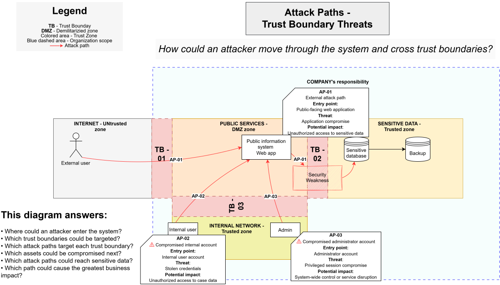

# Attack Paths

> **Core question:** How could an attacker move through the system and cross trust boundaries?

## Purpose

This diagram shows possible attack chains from an initial entry point to compromised system components and sensitive assets.

An attack path represents a sequence of events rather than a single vulnerability or threat.

## AP-01 — External attack path

- **Entry point:** Public-facing web application
- **Boundaries targeted:** TB-01 and TB-02
- **Threat:** Application compromise
- **Potential impact:** Unauthorized access to sensitive data

## AP-02 — Compromised internal account

- **Entry point:** Internal user account
- **Boundary targeted:** TB-03
- **Threat:** Stolen credentials
- **Potential impact:** Unauthorized access to case data

## AP-03 — Compromised administrator account

- **Entry point:** Administrator account
- **Boundary targeted:** TB-03
- **Threat:** Privileged-session compromise
- **Potential impact:** System-wide control or public-service disruption

## This diagram answers

- Where could an attacker enter the system?
- Which trust boundaries could be targeted?
- Which assets could be compromised next?
- How far could an attacker move after initial access?
- Which attack paths could reach sensitive data?
- Which path could cause the greatest business impact?
