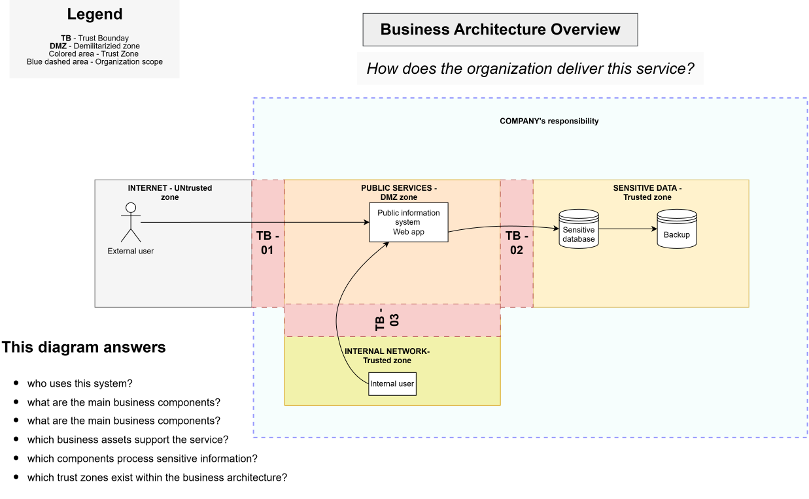

# Business Architecture

> **Core question:** How does the organization deliver this service?

## Purpose

This diagram provides a high-level view of the public digital service, its users, core components, trust zones, and the organization’s area of responsibility.

The organization provides a public digital service used by citizens and employees to process sensitive information.

## Key observations

- External users access the public information system through the internet.
- Internal users and administrators use the same public service.
- Sensitive information is processed and stored in a dedicated data zone.
- Backup storage supports service continuity and recovery.
- The organizational scope begins where the organization assumes responsibility for the service.

## This diagram answers

- Who uses the system?
- What are the main business components?
- How is the public digital service delivered?
- Which business assets support the service?
- Which parts of the system process sensitive information?
- Which trust zones exist within the business architecture?

