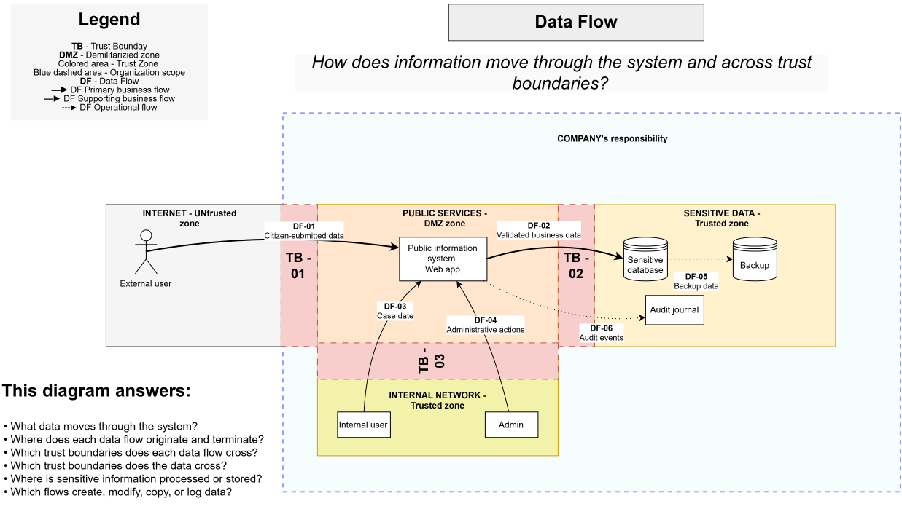

# Data Flow

> **Core question:** How does information move through the system and across trust boundaries?

## Purpose

This diagram identifies the primary business, supporting business, and operational data flows within the public digital service.

## Data flows

### DF-01 — Citizen-submitted data

- **Source:** External user
- **Destination:** Public information system
- **Boundary crossed:** TB-01
- **Type:** Primary business flow

### DF-02 — Validated business data

- **Source:** Public information system
- **Destination:** Sensitive database
- **Boundary crossed:** TB-02
- **Type:** Primary business flow

### DF-03 — Case data

- **Source:** Internal user
- **Destination:** Public information system
- **Boundary crossed:** TB-03
- **Type:** Supporting business flow

### DF-04 — Administrative actions

- **Source:** Administrator
- **Destination:** Public information system
- **Boundary crossed:** TB-03
- **Type:** Supporting business flow

### DF-05 — Backup data

- **Source:** Sensitive database
- **Destination:** Backup storage
- **Type:** Operational flow

### DF-06 — Audit events

- **Source:** Public information system
- **Destination:** Audit journal
- **Type:** Operational flow

## This diagram answers

- What data moves through the system?
- Where does each data flow originate and terminate?
- Which trust boundaries does each data flow cross?
- Where is sensitive information processed or stored?
- Which flows create, modify, copy, or log data?
