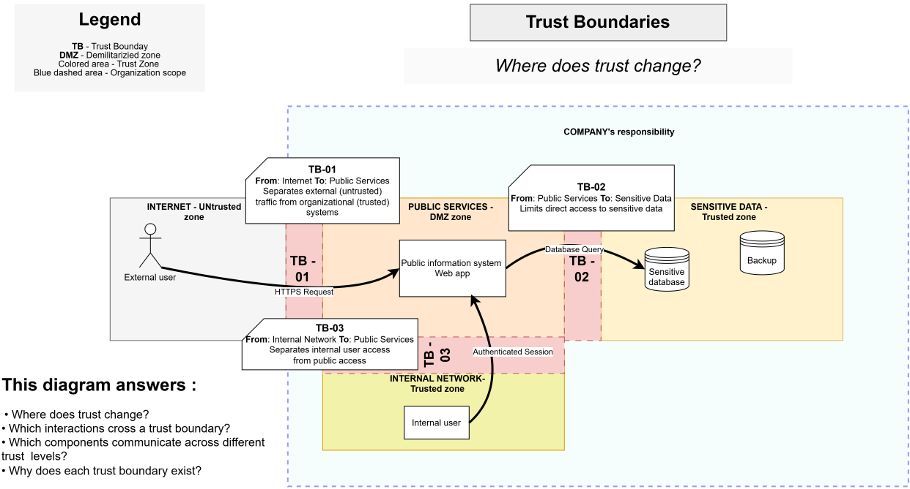

# Trust Boundaries

> **Core question:** Where does trust change?

## Purpose

This diagram identifies the points where interactions move between zones with different trust assumptions.

## Boundaries

### TB-01 — Internet to Public Services

Separates external, untrusted traffic from organization-controlled public services.

### TB-02 — Public Services to Sensitive Data

Separates the public application layer from sensitive data storage.

### TB-03 — Internal Network to Public Services

Separates internal employee and administrative access from public access paths.

## This diagram answers

- Where does trust change?
- Which interactions cross each trust boundary?
- Which components communicate across different trust levels?
- Why does each trust boundary exist?

