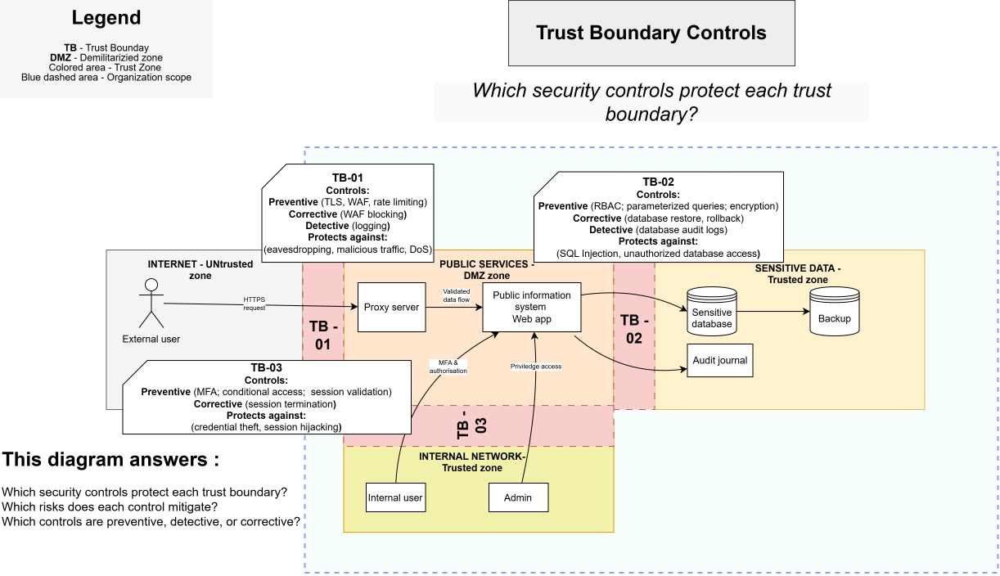

# Trust Boundary Controls

> **Core question:** Which security controls protect each trust boundary?

## Purpose

This diagram links each trust boundary to the preventive and detective controls intended to reduce the risks associated with crossing that boundary.

## TB-01 — Internet to Public Services

### Preventive controls

- TLS
- Web Application Firewall
- Rate limiting

### Detective controls

- WAF and web-server logging

### Protects against

- Eavesdropping
- Malicious traffic
- Denial-of-service activity

## TB-02 — Public Services to Sensitive Data

### Preventive controls

- Role-based access control
- Parameterized queries
- Encryption
- Database firewall

### Detective controls

- Database audit logs

### Protects against

- SQL injection
- Unauthorized database access

## TB-03 — Internal Network to Public Services

### Preventive controls

- Multi-factor authentication
- Conditional Access
- Session validation

### Detective controls

- Authentication and privileged-access logging

### Protects against

- Stolen credentials
- Session hijacking
- Unauthorized privileged access

## This diagram answers

- Which security controls protect each trust boundary?
- Which risks does each control mitigate?
- Which controls are preventive, detective, or corrective?
