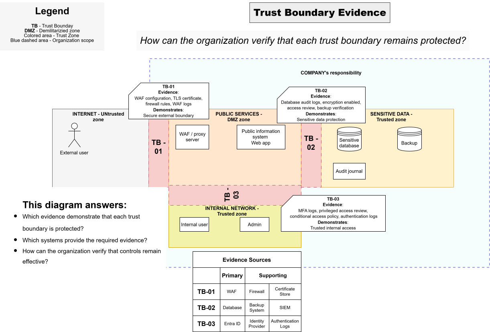

# Trust Boundary Evidence

> **Core question:** How can the organization verify that each trust boundary remains protected?

## Purpose

This diagram identifies the evidence used to demonstrate that the controls protecting each trust boundary exist and remain effective.

It connects architecture and security controls to audit-ready records.

## TB-01 — External boundary evidence

### Evidence

- WAF configuration
- TLS certificate
- Firewall rules
- WAF logs

### Demonstrates

- Secure external boundary

### Evidence sources

- Firewall
- WAF
- Certificate store

## TB-02 — Sensitive data boundary evidence

### Evidence

- Database audit logs
- Encryption enabled
- Access review
- Backup verification

### Demonstrates

- Sensitive data protection

### Evidence sources

- Database
- Backup system
- SIEM

## TB-03 — Internal access boundary evidence

### Evidence

- MFA logs
- Privileged-access review
- Conditional Access policy
- Authentication logs

### Demonstrates

- Controlled internal and privileged access

### Evidence sources

- Identity provider
- Entra ID
- Authentication logs

## This diagram answers

- Which evidence demonstrates that each trust boundary is protected?
- Where can the required evidence be collected?
- Which systems provide the evidence?
- How can the organization verify that controls remain effective?
