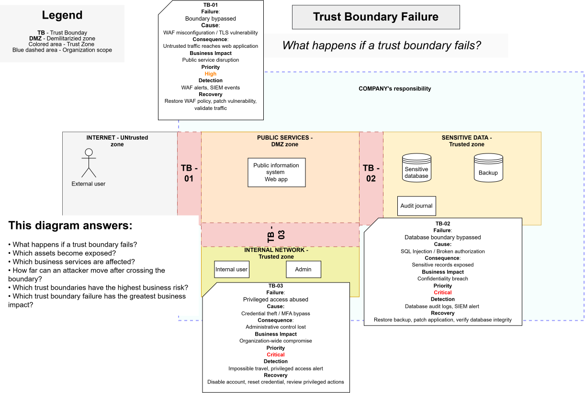

# Trust Boundary Failure

> **Core question:** What happens if a trust boundary fails?

## Purpose

This diagram shows the causes, technical impact, business impact, detection methods, and recovery actions associated with failure of each trust boundary.

It translates technical boundary failure into operational and business risk.

## TB-01 — External boundary failure

- **Failure:** Boundary bypassed
- **Cause:** WAF misconfiguration or TLS vulnerability
- **Technical impact:** Untrusted traffic reaches the public web application
- **Business impact:** Public-service disruption
- **Priority:** High
- **Detection:** WAF alerts and SIEM events
- **Recovery:** Restore the WAF policy, patch the vulnerability, and validate traffic

## TB-02 — Sensitive data boundary failure

- **Failure:** Database boundary bypassed
- **Cause:** SQL injection or broken authorization
- **Technical impact:** Sensitive records exposed
- **Business impact:** Confidentiality breach
- **Priority:** Critical
- **Detection:** Database audit logs and SIEM alert
- **Recovery:** Patch the application, restore trusted data if required, and verify database integrity

## TB-03 — Internal and privileged boundary failure

- **Failure:** Privileged access abused
- **Cause:** Credential theft or MFA bypass
- **Technical impact:** Administrative control lost
- **Business impact:** Organization-wide compromise
- **Priority:** Critical
- **Detection:** Impossible-travel alert and privileged-access alert
- **Recovery:** Disable the account, reset credentials, and review privileged actions

## This diagram answers

- What happens if a trust boundary fails?
- Which assets become exposed?
- Which business services are affected?
- How far can a compromise spread after crossing the boundary?
- Which failures require immediate response?
- Which trust boundary failure has the greatest business impact?
