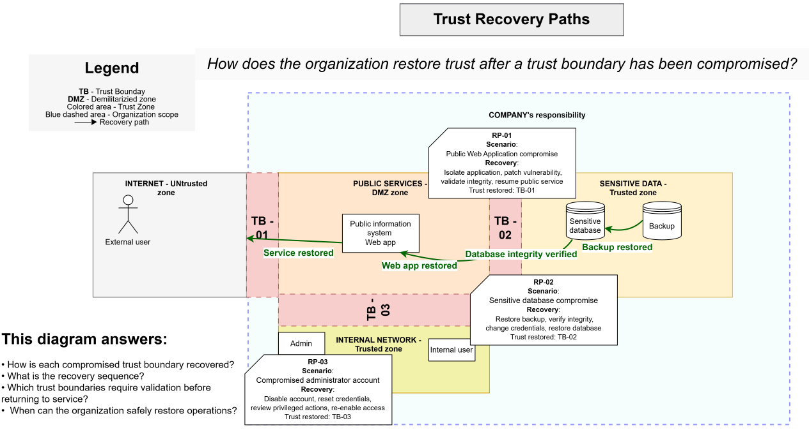

# Trust Recovery Paths

> **Core question:** How does the organization restore trust after a trust boundary has been compromised?

## Purpose

This diagram shows how trust is restored after compromise.

The recovery sequence moves from trusted backup data to an integrity-verified database, a restored web application, and finally a safely resumed public service.

## Recovery sequence

1. Restore data from trusted backup.
2. Verify database integrity.
3. Restore the public web application.
4. Validate the affected trust boundaries.
5. Resume the public service.

## RP-01 — Public web application compromise

### Recovery

- Isolate the application
- Patch the vulnerability
- Validate application integrity
- Restore the public service

### Trust restored

- TB-01

## RP-02 — Sensitive database compromise

### Recovery

- Restore trusted backup
- Verify database integrity
- Rotate affected credentials
- Restore the database

### Trust restored

- TB-02

## RP-03 — Compromised administrator account

### Recovery

- Disable the affected account
- Reset credentials
- Review privileged actions
- Re-enable access only after validation

### Trust restored

- TB-03

## This diagram answers

- How is each compromised trust boundary recovered?
- What is the recovery sequence?
- Which trust boundaries require validation before returning to service?
- When can the organization safely restore operations?
