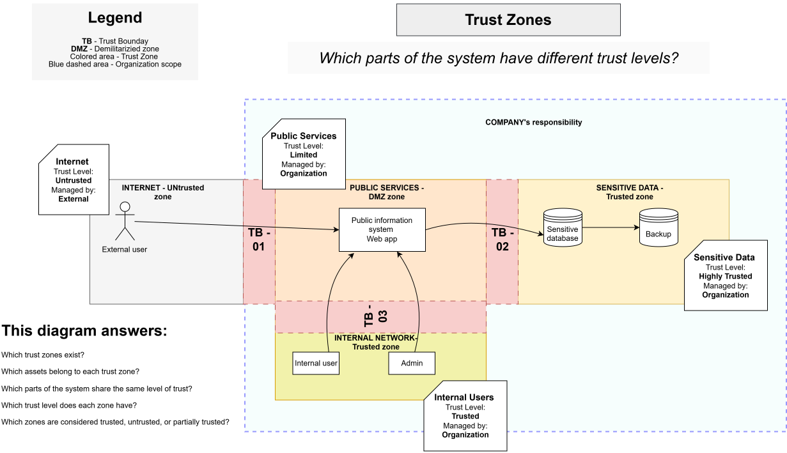

# Trust Zones

> **Core question:** Which parts of the system have different trust levels?

## Purpose

This diagram groups system components into zones that share similar trust assumptions, levels of organizational control, and security expectations.

## Trust zones

### Internet

- **Trust level:** Untrusted
- **Managed by:** External parties
- **Primary asset:** External user access

### Public Services

- **Trust level:** Limited
- **Managed by:** Organization
- **Primary asset:** Public information system

### Internal Network

- **Trust level:** Trusted
- **Managed by:** Organization
- **Primary assets:** Internal users and administrators

### Sensitive Data

- **Trust level:** Highly trusted
- **Managed by:** Organization
- **Primary assets:** Sensitive database and backup storage

## This diagram answers

- Which trust zones exist?
- Which assets belong to each trust zone?
- Which parts of the system share the same level of trust?
- Which trust level does each zone have?
- Which zones are trusted, untrusted, or partially trusted?
