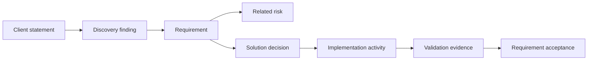

# Requirements Register

## Purpose

The Requirements Register records, validates, prioritises, and tracks requirements identified during cybersecurity discovery.

Its purpose is to create a clear link between:

* the client’s original concern;
* discovery findings;
* business and security risks;
* proposed solution decisions;
* implementation activities;
* validation evidence.

A requirement should not be treated as confirmed only because it was mentioned during a meeting. Each requirement should have a clear source, owner, status, and validation method.

---

## 1. Requirement Types

Requirements are classified into the following categories:

| Type        | Description                                                                |
| ----------- | -------------------------------------------------------------------------- |
| Business    | Business outcome or organisational need                                    |
| Functional  | Capability the solution must provide                                       |
| Security    | Security property or control that must be implemented                      |
| Operational | Requirement related to administration, support, monitoring, or maintenance |
| Technical   | Infrastructure, integration, performance, or compatibility requirement     |
| Compliance  | Legal, regulatory, contractual, or audit requirement                       |
| User        | Requirement related to usability, accessibility, or user experience        |
| Evidence    | Documentation or proof required to demonstrate implementation              |
| Transition  | Requirement related to migration, rollout, training, or handover           |

---

## 2. Priority Model

Requirements may be prioritised using the MoSCoW method.

| Priority | Meaning                                                 |
| -------- | ------------------------------------------------------- |
| Must     | Essential for project acceptance                        |
| Should   | Important, but a temporary workaround may be acceptable |
| Could    | Useful improvement if time and resources allow          |
| Won’t    | Explicitly excluded from the current scope              |

Priority should reflect business impact and risk, not only stakeholder preference.

---

## 3. Requirement Status

| Status       | Meaning                                                 |
| ------------ | ------------------------------------------------------- |
| Proposed     | Identified but not yet reviewed                         |
| Under review | Being validated with stakeholders or evidence           |
| Confirmed    | Approved as a valid project requirement                 |
| Rejected     | Determined to be unnecessary, incorrect, or unsupported |
| Deferred     | Valid, but postponed to a later phase                   |
| Implemented  | Technical or procedural implementation completed        |
| Validated    | Implementation tested and evidence accepted             |

---

## 4. Requirements Register

| Requirement ID | Requirement | Type | Source | Related discovery finding | Related risk | Priority                      | Owner | Validation method | Status   |
| -------------- | ----------- | ---- | ------ | ------------------------- | ------------ | ----------------------------- | ----- | ----------------- | -------- |
| REQ-001        |             |      |        |                           |              | Must / Should / Could / Won’t |       |                   | Proposed |
| REQ-002        |             |      |        |                           |              |                               |       |                   |          |
| REQ-003        |             |      |        |                           |              |                               |       |                   |          |

---

## 5. Detailed Requirement Record

Use this section when a requirement requires additional explanation.

### Requirement ID

`REQ-XXX`

### Requirement statement

> The solution shall...

### Business reason

> Explain why this requirement is necessary.

### Source

* stakeholder;
* audit finding;
* legal or contractual requirement;
* incident;
* discovery observation;
* technical dependency.

### Related risks

| Risk ID | Relationship |
| ------- | ------------ |
|         |              |

### Acceptance criteria

* [ ]
* [ ]
* [ ]

### Validation evidence

| Evidence | Evidence owner | Required before acceptance |
| -------- | -------------- | -------------------------- |
|          |                | Yes / No                   |

### Dependencies

| Dependency | Description |
| ---------- | ----------- |
|            |             |

### Constraints

| Constraint | Impact |
| ---------- | ------ |
|            |        |

### Approval

| Role               | Name | Decision                       | Date |
| ------------------ | ---- | ------------------------------ | ---- |
| Requirement owner  |      | Approved / Rejected / Deferred |      |
| Technical reviewer |      | Approved / Changes required    |      |
| Security reviewer  |      | Approved / Changes required    |      |

---

## 6. Requirement Writing Guidance

Requirements should be:

* specific;
* testable;
* traceable;
* understandable;
* realistically implementable;
* linked to a business or security need.

A requirement should describe the expected result, not only the preferred product.

### Weak requirement

> Implement a secure VPN.

This is unclear because “secure” is not measurable.

### Improved requirement

> All remote administrative access shall require multi-factor authentication and shall be restricted to approved user accounts and managed devices.

### Weak requirement

> Logs must be available.

### Improved requirement

> Authentication and remote-access events shall be retained for at least 90 days and shall include the user, source address, timestamp, action, and result.

---

## 7. Requirement Source and Confidence

A requirement may originate from confirmed evidence or from an unverified interpretation.

| Confidence | Meaning                                                                |
| ---------- | ---------------------------------------------------------------------- |
| High       | Supported by evidence or confirmed by an authorised owner              |
| Medium     | Supported by several statements but still requires formal confirmation |
| Low        | Based mainly on an assumption or incomplete information                |

| Requirement ID | Source statement | Confidence          | Evidence required |
| -------------- | ---------------- | ------------------- | ----------------- |
|                |                  | High / Medium / Low |                   |

Low-confidence requirements should not become mandatory implementation decisions without validation.

---

## 8. Requirements Traceability

Requirements should be traceable throughout the project.

### Traceability Table

| Requirement ID | Discovery ID | Risk ID | Decision ID | Action ID | Evidence ID | Final status |
| -------------- | ------------ | ------- | ----------- | --------- | ----------- | ------------ |
|                |              |         |             |           |             |              |

---

## 9. Requirement Conflicts

Requirements may conflict with each other.

Examples include:

* stronger authentication versus user convenience;
* detailed logging versus privacy requirements;
* rapid implementation versus complete testing;
* high availability versus limited budget;
* strict access controls versus emergency operational access.

| Conflict ID | Requirement A | Requirement B | Conflict | Decision required from |
| ----------- | ------------- | ------------- | -------- | ---------------------- |
| CONFLICT-01 |               |               |          |                        |

Conflicts should be escalated to the appropriate business or risk owner rather than silently resolved by the technical team.

---

## 10. Requirement Changes

Changes should be recorded when a confirmed requirement is modified, removed, or replaced.

| Change ID | Requirement ID | Previous requirement | New requirement | Reason | Approved by | Date |
| --------- | -------------- | -------------------- | --------------- | ------ | ----------- | ---- |
| CHG-001   |                |                      |                 |        |             |      |

Possible reasons include:

* new evidence;
* scope change;
* technical limitation;
* budget restriction;
* stakeholder decision;
* regulatory change;
* failed validation.

---

## 11. Example Requirements

The following examples use a fictional secure remote-access project.

| Requirement ID | Requirement                                                       | Type        | Source           | Related risk                                    | Priority | Validation method                          | Status       |
| -------------- | ----------------------------------------------------------------- | ----------- | ---------------- | ----------------------------------------------- | -------- | ------------------------------------------ | ------------ |
| REQ-001        | All remote access shall require MFA                               | Security    | Audit finding    | Compromised password may provide remote access  | Must     | Login test without MFA must fail           | Confirmed    |
| REQ-002        | Remote access shall be limited to approved user groups            | Security    | System owner     | Excessive access privileges                     | Must     | Access test using unauthorised account     | Confirmed    |
| REQ-003        | Remote-access events shall be centrally logged                    | Evidence    | Security team    | Incidents may not be detected or investigated   | Must     | Verify events in central logging platform  | Proposed     |
| REQ-004        | The solution shall support managed Windows devices                | Technical   | IT administrator | Unsupported devices may create support failures | Must     | Pilot test on approved devices             | Confirmed    |
| REQ-005        | Access shall be removed within one business day after termination | Operational | HR and IT        | Former employees may retain access              | Must     | Test termination workflow                  | Under review |
| REQ-006        | A fallback process shall exist for MFA service failure            | Continuity  | Business owner   | Users may lose access during provider outage    | Should   | Simulated service-failure test             | Proposed     |
| REQ-007        | Administrators shall receive a documented support procedure       | Transition  | IT administrator | Solution may depend on the implementer          | Must     | Handover review and administrator approval | Proposed     |
| REQ-008        | The pilot shall include at least five users from different roles  | Transition  | Project team     | Pilot may not represent real usage              | Should   | Pilot participant list and results         | Proposed     |

---

## 12. Requirement Review Checklist

Before confirming a requirement, verify that:

* the source is known;
* the requirement addresses a real need;
* facts and assumptions are separated;
* the requirement is testable;
* the requirement has an owner;
* the priority is justified;
* related risks are identified;
* dependencies and constraints are recorded;
* acceptance criteria are defined;
* required evidence is known;
* conflicting requirements have been considered;
* the client can confirm the wording.

---

## 13. Minimum Project Output

For a small discovery project, the minimum Requirements Register should contain:

1. requirement ID;
2. clear requirement statement;
3. requirement type;
4. source;
5. related risk;
6. priority;
7. owner;
8. validation method;
9. current status.

This minimum structure is sufficient to demonstrate traceability between an ambiguous client request and a testable implementation outcome.
