# ISO/IEC 27001:2022 Control Dependency Map

**Version:** v1.0

## 1. Purpose

ISO/IEC 27001 controls are often reviewed as independent checklist items. In practice, many controls only function effectively because other controls support them. This project provides a compact visual and tabular model of how a set of important Annex A controls and ISO clause/process activities depend on one another, and what weakens downstream when an upstream control is ineffective.

## 2. Intended audience

This project is intended as a learning, portfolio, and discussion resource for security practitioners, students, and consultants interested in ISO/IEC 27001 control design and dependencies.

## 3. How to read the diagrams

Each diagram is a Mermaid `flowchart LR` (left-to-right). Nodes are grouped into functional bands — **Governance, Prevent, Detect, Respond, Recover** — matching how a management audience typically reasons about a security program. An arrow from control A to control B means "the effectiveness of B depends, in whole or in part, on A." Each diagram includes a small legend describing node shading and arrow style.

## 4. Relationship types and arrow meanings

| Type | Meaning |
|---|---|
| ENABLES | The source control is a functional precondition for the target control |
| SUPPORTS | The source control strengthens or informs the target control, without being strictly required |
| PROVIDES_EVIDENCE | The source control's output is used to assess or improve the target control |
| RECOVERY_DEPENDENCY | The target control's recovery outcome depends directly on the source control |

**Arrow style:**

- **Solid arrow** — stronger dependency (typically 'ENABLES' or 'RECOVERY_DEPENDENCY')  
- **Dotted arrow** — weaker or supporting dependency (typically 'SUPPORTS' or 'PROVIDES_EVIDENCE')  

## 5. Strength and confidence scales

**Strength (1–5):** the expected degree of downstream degradation if the source control fails, from minor (1) to severe/blocking (5).

**Confidence:**

| Level | Meaning |
|---|---|
| High | Strongly supported by the standard or clear operational logic |
| Medium | Reasonable professional interpretation; context-dependent |
| Low | Plausible but less certain; more likely to vary by organization |

## 6. Level 1 vs Level 2

- **Level 1 (Management Overview):** one compact diagram showing only the strongest, most management-relevant dependencies across the entire model. Intended for briefings and executive review.

<a href="assets/level1_management_overview.svg"
   target="_blank"
   rel="noopener noreferrer">
  Open the full-size diagram in a new tab
</a>

- **Level 2 (Detail Views):** three focused sub-diagrams — *Governance + Risk*, *Prevent + Access + Supplier + Vulnerability*, and *Detect + Respond + Recover* — that expand on the same underlying dependencies with more operational detail, for use in working sessions or deeper review.

## Level 2a — Governance and Risk

<a href="assets/level2a_governance_risk.svg"
   target="_blank"
   rel="noopener noreferrer">
  Open the full-size diagram in a new tab
</a>

## Level 2b — Prevent, Access, Supplier and Vulnerability

<a href="assets/level2b_prevent_access_supplier_vuln.svg"
   target="_blank"
   rel="noopener noreferrer">
  Open the full-size diagram in a new tab
</a>

## Level 2c — Detect, Respond and Recover

<a href="assets/level2c_detect_respond_recover.svg"
   target="_blank"
   rel="noopener noreferrer">
  Open the full-size diagram in a new tab
</a>

Both levels draw from the same underlying dependency data; Level 2 is not a separate model.

## 7. Methodological limitations

- This is an **analytical model built for this project**, not official ISO guidance and not an ISO-endorsed artifact.
- Dependencies reflect **general, typical patterns**. Actual dependencies are contextual and may differ between organizations depending on architecture, outsourcing, maturity, and risk tolerance.
- ISO 27001 **clause/process nodes** (e.g., Clause 6.1 Risk Assessment/Treatment) are visually distinguished from **Annex A control nodes** using distinct node shading, since they represent different types of requirements within the standard.
- To preserve diagram readability, **only the strongest dependencies are drawn**. Weaker or lower-confidence relationships (typically Strength 1–2) are recorded **only in the dependency table**, not in the diagrams.
- Control names are short, paraphrased labels for diagram compactness — not verbatim ISO control text.
- The model should support professional judgment, not replace it.

For the dependency selection, scoring rules, relationship taxonomy, and diagram inclusion criteria, see [Methodology](methodology.md).

## 8. Version

**v1.0** — 18 anchor controls across Level 1; 56 dependency rows in the consolidated table; four Mermaid diagrams (one Level 1, three Level 2), quality-reviewed for label consistency, arrow/table alignment, and duplicate-free relationships.
