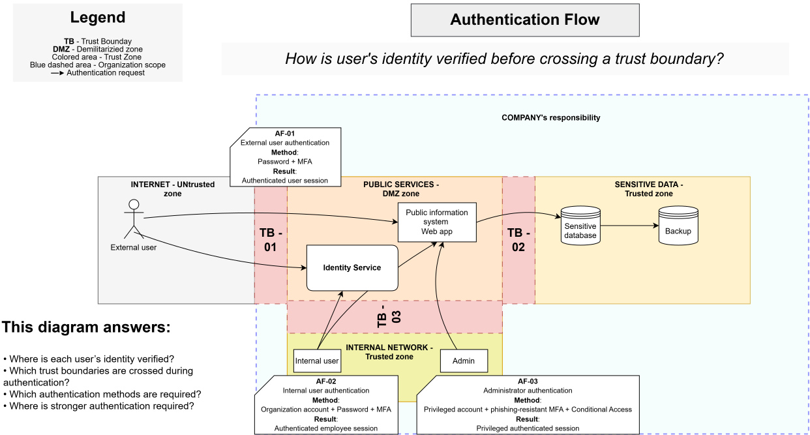

# Authentication Flow

> **Core question:** How is a user’s identity verified before crossing a trust boundary?

## Purpose

This diagram shows how external users, internal users, and administrators prove their identity before receiving an authenticated session.

Authentication confirms who the user is. It does not determine what the user is allowed to do.

## AF-01 — External user authentication

- **Method:** Password and MFA
- **Result:** Authenticated user session
- **Relevant boundary:** TB-01

## AF-02 — Internal user authentication

- **Method:** Organization account, password, and MFA
- **Result:** Authenticated employee session
- **Relevant boundary:** TB-03

## AF-03 — Administrator authentication

- **Method:** Privileged account, phishing-resistant MFA, and Conditional Access
- **Result:** Privileged authenticated session
- **Relevant boundary:** TB-03

## This diagram answers

- Where is each user’s identity verified?
- Which trust boundaries are crossed during authentication?
- Which authentication methods are required?
- Where is stronger authentication required?
- What authenticated session is issued?
